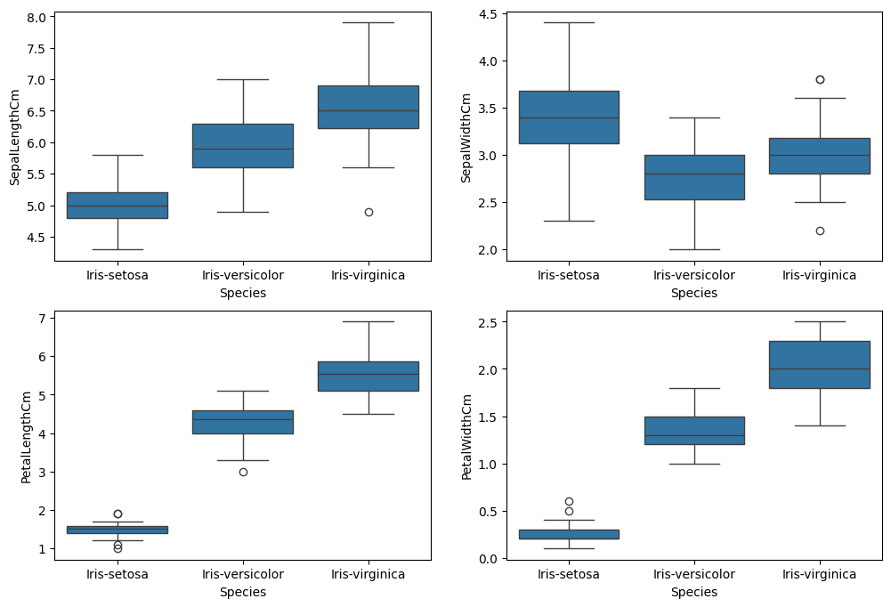
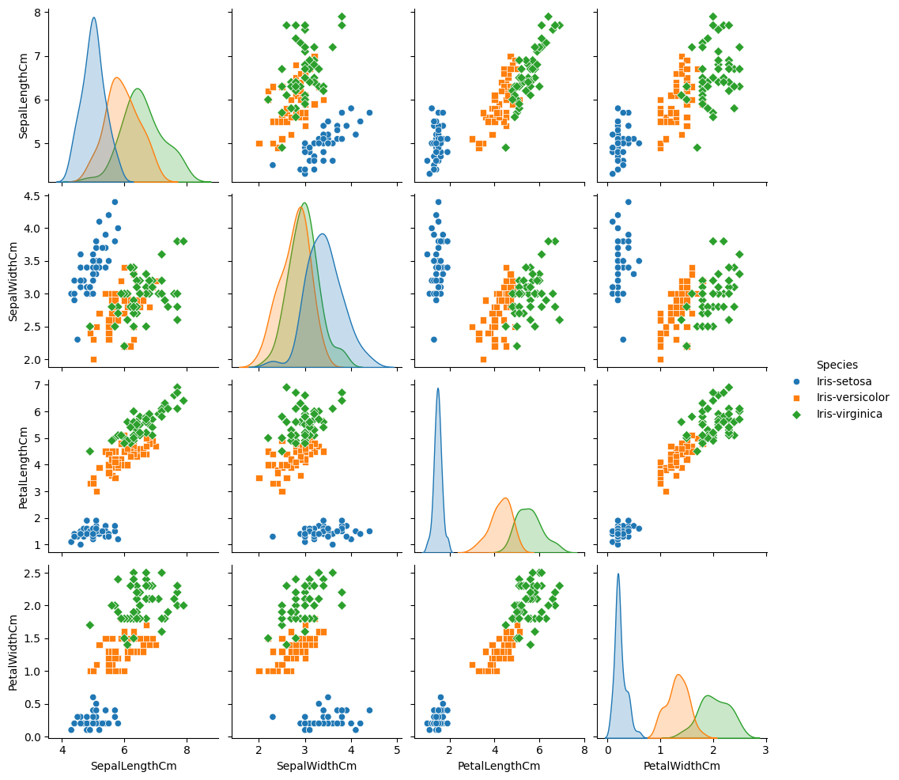
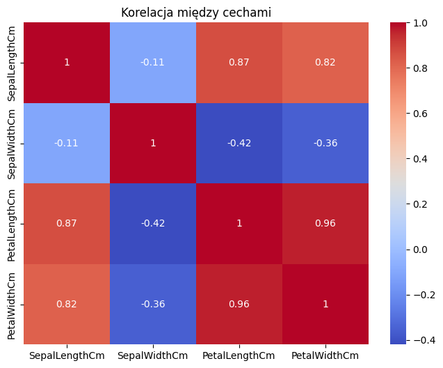
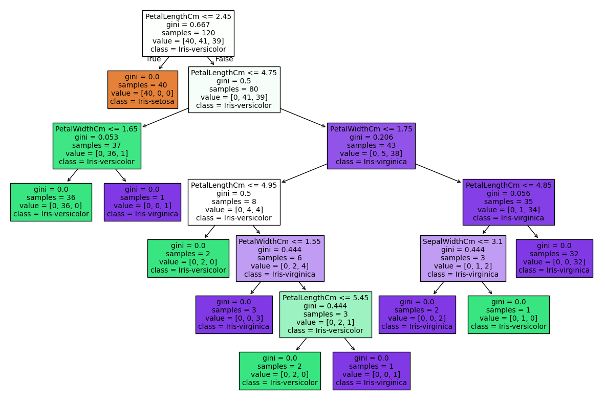

# Iris Flower Classification

### 📌 Cel Projektu

Projekt skupia się na wytrenowaniu modelu do przewidywania gatunku kwiatu **Irys** na podstawie 4 cech:

- długość działki kielicha (_sepal length_)
- szerokość działki kielicha (_sepal width_)
- długość płatka (_petal length_)
- szerokość płatka (_petal width_)

### 📊 Interesujące wykresy

Wykresy pudełkowe (boxplots) dla czterech cech irysów w podziale na ich gatunki. Pozwalają one porównać rozkłady wymiarów kwiatów i zauważyć, że cechy płatków (_Petal_) znacznie wyraźniej różnicują poszczególne klasy niż cechy działek kielicha (_Sepal_).

Macierz wykresów punktowych (pairplot) wizualizuje korelacje między cechami. Zestawienie to pokazuje, że gatunek **Iris-setosa** wyraźnie odróżnia się od pozostałych, szczególnie pod względem mniejszej długości i szerokości płatków (_Petal_).

Ta heatmapa przedstawia współczynniki korelacji Pearsona między wszystkimi numerycznymi cechami irysów. Pozwala ona zauważyć bardzo silną dodatnią zależność między wymiarami płatków (_PetalLength_ i _PetalWidth_), co sugeruje, że te cechy dostarczają zbliżonych informacji klasyfikacyjnych.

Poniżej znajduje się wizualizacja wyuczonego **drzewa decyzyjnego**, która pokazuje logiczną ścieżkę klasyfikacji kwiatów na podstawie progowych wartości ich cech.

### 🛠️ Użyte Narzędzia i Techniki

- **Python:** Główne narzędzie analizy.

- **Pandas:** Zaawansowane manipulacje danymi.

- **Seaborn & Matplotlib:** Profesjonalne wizualizacje.

### 📂 Struktura Repozytorium

- Iris.ipynb - Pełny notebook z kodem i komentarzami.
- Iris.csv - Zbiór danych z Kaggle.
- /images - Wykresy wyeksportowane do formatu .png.

### 🚀 Jak uruchomić projekt?

1. Sklonuj repozytorium: git clone [https://github.com/Mr-TwisT/Iris-Flower-Classification.git](https://github.com/Mr-TwisT/Iris-Flower-Classification.git)
2. Zainstaluj wymagane biblioteki.
3. Otwórz plik .ipynb w Jupyter Notebook lub Google Colab.
